# Controlled Great Expectations Failure and Recovery Demo

This document records a safe, controlled failure test of the NYC Mobility pipeline's Great Expectations (GX) quality gate. The test proves that the pipeline fails closed, skips downstream dashboard refreshes, sends a failure notification, and can recover successfully after the demo condition is removed.

> [!WARNING]
> This procedure is for the Databricks **development** deployment only. The demo branch and `DEMO_FORCE_GX_FAILURE = True` must never be merged into `main`.

## What this demo proves

- The complete upstream flow can run successfully before the quality gate is evaluated.
- GX blocks the pipeline when a governed validation result is `FAIL`.
- Downstream dashboard refresh tasks do not run after the gate fails.
- Databricks sends an automatic failure email after the final failed attempt.
- The controlled test does not insert corrupt source data or modify pipeline tables.
- After the demo flag is disabled and the development bundle is redeployed, a fresh run succeeds through the quality gate and both dashboard refresh tasks.

## Recorded results

| Scenario | Databricks job run ID | Result | Evidence |
| --- | ---: | --- | --- |
| Controlled GX failure | `82696912080900` | Expected failure | `consolidated_quality_gate` failed after two attempts; downstream tasks were skipped; email alert was received |
| Recovery run | `660581942298334` | Success | GX passed and the analytics and quality dashboards refreshed |

## Safety design

The failure was introduced in a separate branch named `demo/intentional-gx-failure`. Pull request #83 was deliberately kept unmerged.

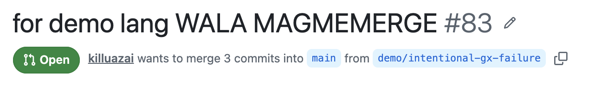

The pull-request preview deployment and CI checks passed, while repository governance kept merging blocked pending Code Owner review.

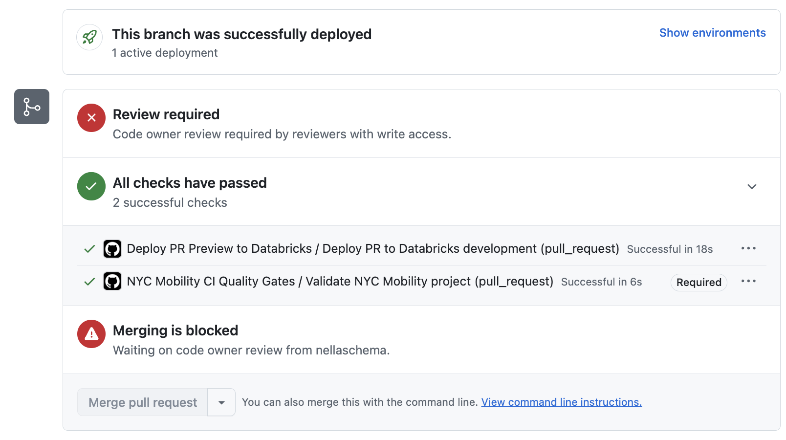

The test changed only one in-memory validation result before GX evaluated the 14-row quality-check result set. It did **not** inject bad data, update business tables, or alter the production deployment.

```python
# DEMO ONLY: intentionally force one in-memory quality result to fail.
# This branch must never be merged into main.
DEMO_FORCE_GX_FAILURE = True

gx_checks_df = checks_df

if DEMO_FORCE_GX_FAILURE:
    demo_check_name = "Analytics validation passes"

    gx_checks_df = (
        checks_df
        .withColumn(
            "status",
            F.when(
                F.col("check_name") == demo_check_name,
                F.lit("FAIL"),
            ).otherwise(F.col("status")),
        )
        .withColumn(
            "actual_value",
            F.when(
                F.col("check_name") == demo_check_name,
                F.lit("DEMO_ONLY: intentionally forced failure"),
            ).otherwise(F.col("actual_value")),
        )
    )

# Convert only the controlled GX input to pandas.
checks_pdf = gx_checks_df.toPandas()
```


## Demo procedure

### 1. Deploy the demo branch to development

1. Create the isolated branch `demo/intentional-gx-failure`.
2. Set `DEMO_FORCE_GX_FAILURE = True` in `tests/end_to_end/02_great_expectations_quality_gate.ipynb`.
3. Open a pull request, but do not approve or merge it.
4. Wait for both the CI quality gate and **Deploy PR Preview to Databricks** checks to pass.
5. In Databricks, open the PR-deployed job whose name begins with `[dev ...]`. Do not run a production job or an older duplicate.

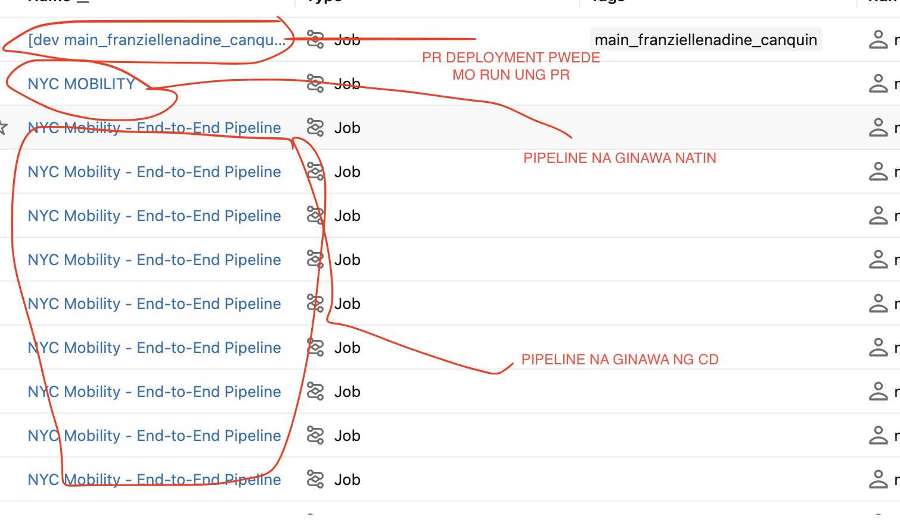

### 2. Run the controlled failure

Click **Run now** on the development job and record the task timeline. In the captured run, ingestion, Bronze, Silver, Gold, analytics, and data-quality view tasks all succeeded before GX evaluated the results.

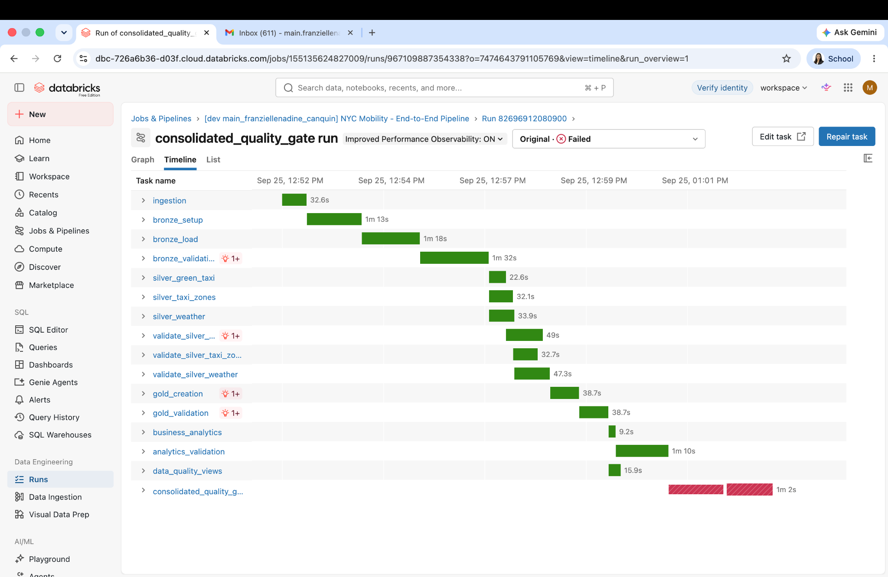

The two inputs to the quality gate completed successfully, but `consolidated_quality_gate` failed as designed.

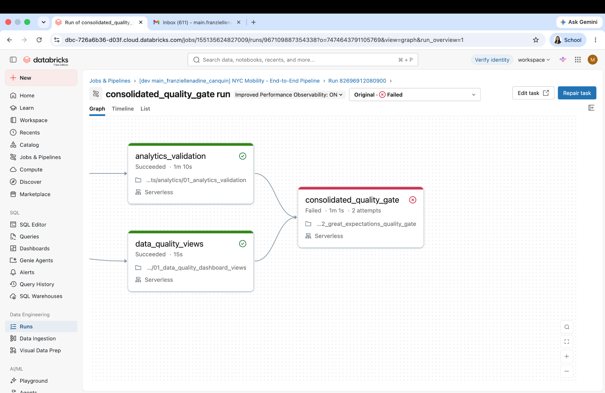

GX identified the intentionally failed check and stopped execution with this message:

```text
Great Expectations quality gate FAILED.
Failed expectation: expect_column_values_to_be_in_set
- Analytics validation passes

Exception: Great Expectations quality gate failed. Pipeline execution stopped.
```

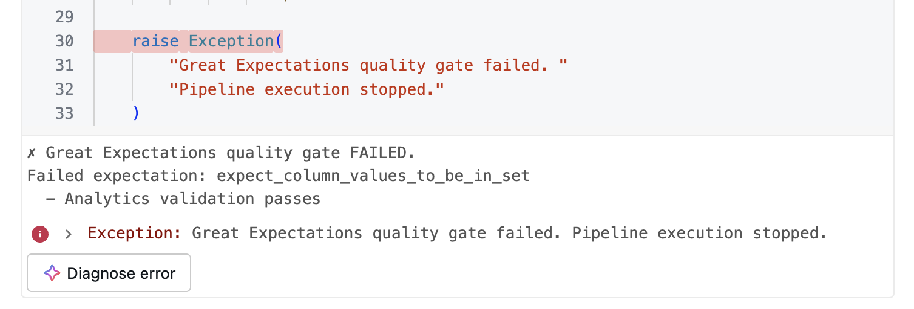

The final failed attempt is recorded under job run `82696912080900`.

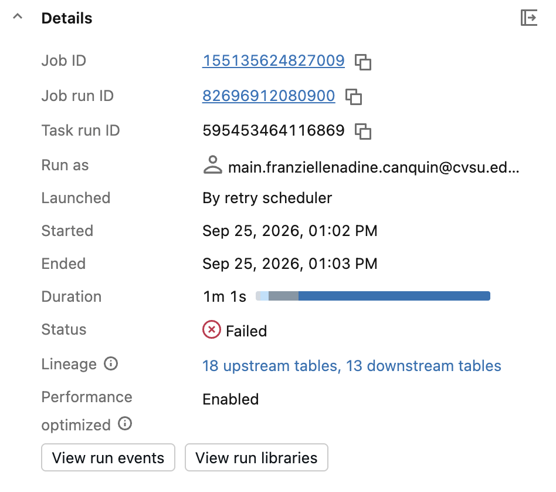

### 3. Verify fail-closed behavior and monitoring

Confirm the following before starting recovery:

- `consolidated_quality_gate` is red/failed.
- The overall job is failed.
- Tasks that depend on the quality gate, including dashboard refresh tasks, did not execute.
- The configured recipient received the Databricks failure email.

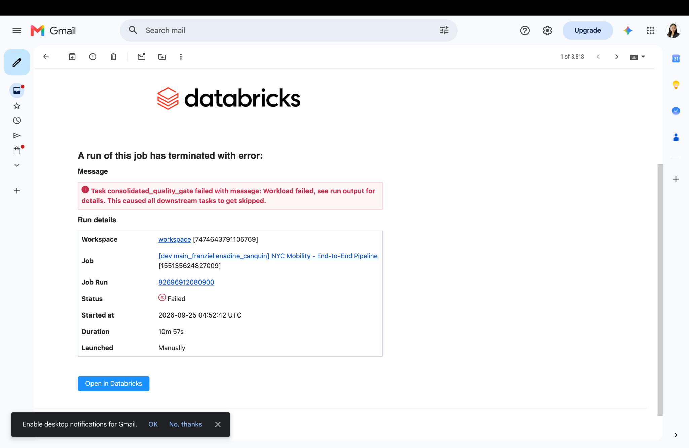

## Recovery procedure

### 1. Remove the controlled failure

On the same demo branch, change only the flag:

```python
DEMO_FORCE_GX_FAILURE = False
```

Commit the change and wait for the development preview deployment to finish. Do not merge the demo branch.

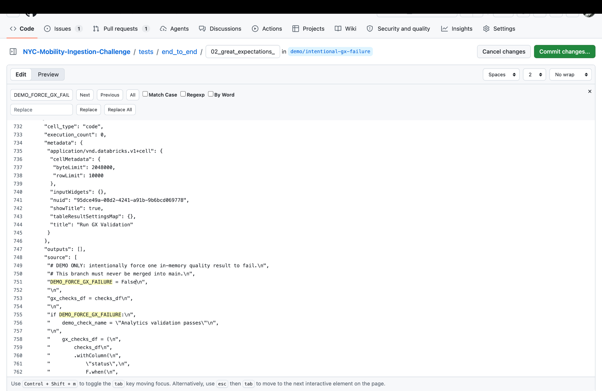

### 2. Start a fresh development run

Start a new run of the same `[dev ...] NYC Mobility - End-to-End Pipeline` job. A fresh run is preferable to repairing the intentionally failed run because it demonstrates the complete recovery path using the redeployed notebook.

The quality gate should now succeed:

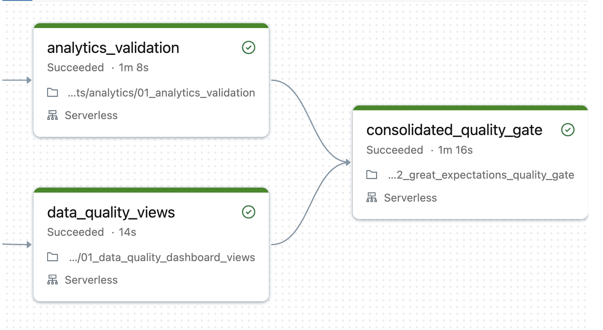

The recorded recovery run completed successfully in 15 minutes and 13 seconds.

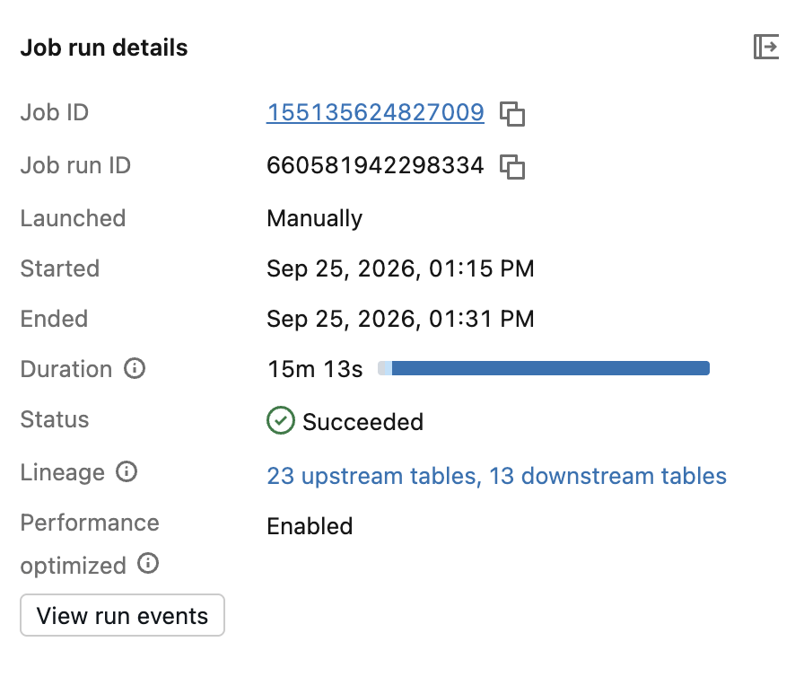

The complete recovery timeline shows that `consolidated_quality_gate`, `refresh_analytics_dashboard`, and `refresh_quality_dashboard` all succeeded.

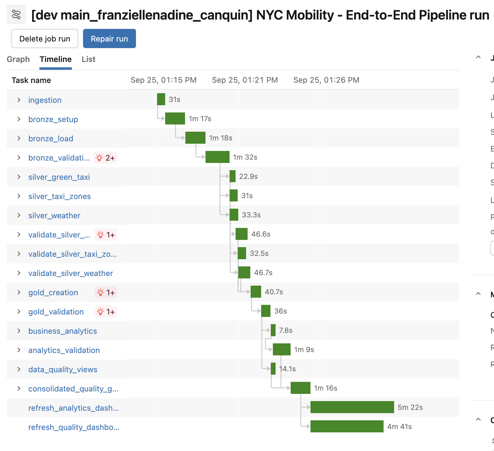

### 3. Clean up

1. Confirm `DEMO_FORCE_GX_FAILURE = False` in the branch.
2. Close pull request #83 without merging it.
3. Delete the demo branch after the evidence has been saved.
4. Keep the production `main` branch unchanged.

## Expected behavior summary

| Check | Failure run | Recovery run |
| --- | --- | --- |
| Ingestion through analytics | Succeeded | Succeeded |
| Data-quality views | Succeeded | Succeeded |
| GX consolidated quality gate | **Failed as designed** | Succeeded |
| Analytics dashboard refresh | Skipped | Succeeded |
| Data-quality dashboard refresh | Skipped | Succeeded |
| Failure email | Sent | Not applicable |
| Pipeline data | Unchanged by the demo injection | Safely rerun |
| Overall job | **Failed as expected** | **Succeeded** |

## Short presentation script

> We deployed a demo-only branch to the Databricks development target without merging it into `main`. The change forced one in-memory validation result to fail, so no source or business data was corrupted. All upstream tasks completed, then the Great Expectations gate rejected the result and stopped the pipeline. Because the job failed closed, downstream dashboard refreshes were skipped and the team received an automatic failure email. We then disabled the demo flag, redeployed the branch, and started a fresh run. GX passed and both dashboards refreshed, proving that the pipeline can detect a quality failure and recover safely.

## Source evidence

The original screenshots are collected in the team [Google Doc](https://docs.google.com/document/d/1rhg4YWcgsWWqRPRPTNABdNbKHQYRvuOfhxvF1NIurRo/edit?usp=sharing).
