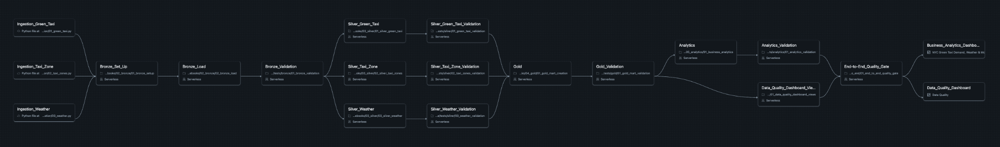
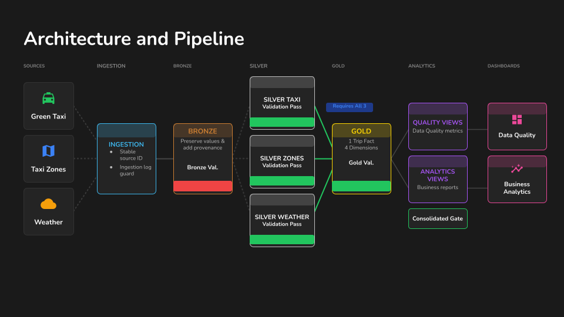
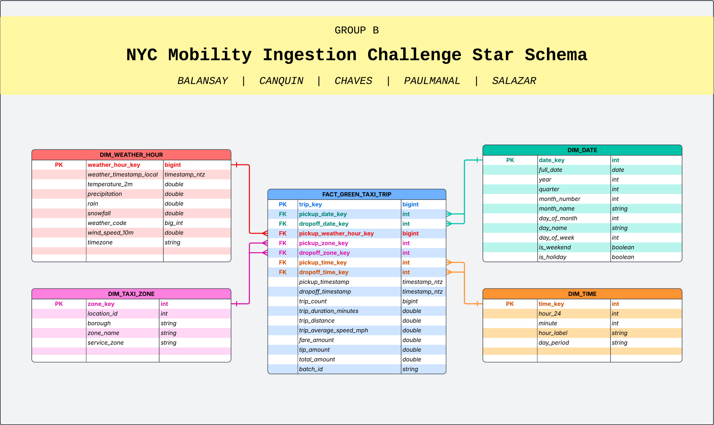

# NYC Mobility Ingestion Challenge

[](https://github.com/ftw-group-b/NYC-Mobility-Ingestion-Challenge/actions/workflows/ci.yml)
[](https://github.com/ftw-group-b/NYC-Mobility-Ingestion-Challenge/actions/workflows/deploy-databricks.yml)

This repository contains Group B's complete Databricks pipeline for NYC Green Taxi analytics. It incrementally ingests March-May 2026 trip files, combines them with NYC Taxi Zones and hourly Open-Meteo weather, validates every layer, and publishes a Gold star schema for two dashboard outputs:

- Data Quality Dashboard
- Business-Ready Analytics Dashboard

The implementation uses Databricks notebooks, Delta tables, SQL views, Databricks Asset Bundles, Great Expectations, and GitHub Actions. It does not use dbt.

## Architecture

### Databricks job pipeline



### Group B architecture overview



The deployed job follows this order:

1. Incremental ingestion
2. Bronze setup and load
3. Bronze validation
4. Parallel Silver transformations for Green Taxi, Taxi Zones, and Weather
5. Separate Silver validations
6. Gold star-schema creation
7. Gold validation
8. Data-quality views and business analytics views
9. Analytics validation
10. Great Expectations consolidated end-to-end quality gate

See [Architecture](docs/architecture/README.md) for the task-level design.

## Gold model



The Gold fact grain is one accepted Silver Green Taxi source record. Gold keeps the complete fact population and uses `dq_out_of_range_datetime` to separate the March-May analytical window from valid late-arriving records.

See [Data Model](docs/data_model/README.md) for table grains, keys, and the data dictionary.

## Data sources

| Source | Format | Coverage | Pipeline use |
|---|---|---|---|
| NYC TLC Green Taxi trips | Monthly Parquet | March-May 2026 | Main trip fact source |
| NYC TLC Taxi Zone lookup | CSV | Current reference file | Pickup and drop-off geography |
| Open-Meteo historical weather | JSON API response | March-May 2026 hourly labels | Pickup-hour weather context |

Traffic Advisory files were explored and retained outside the completed analytical model. Their date coverage was incomplete for the required period, so they are not part of Bronze, Silver, Gold, or the dashboards.

## Source attribution

- [NYC Taxi and Limousine Commission Trip Record Data](https://www.nyc.gov/site/tlc/about/tlc-trip-record-data.page) provides the monthly Green Taxi Parquet files and official Taxi Zone lookup used by this project. TLC notes that trip records are submitted by authorized technology providers and does not independently guarantee every reported value.
- [Open-Meteo Historical Weather API](https://open-meteo.com/en/docs/historical-weather-api) provides the hourly weather context. Open-Meteo data is made available under the [Creative Commons Attribution 4.0 International license](https://creativecommons.org/licenses/by/4.0/).

## Repository structure

```text
.
├── notebooks/
│   ├── 00_source_inspection/
│   ├── 01_ingestion/
│   ├── 02_bronze/
│   ├── 03_silver/
│   ├── 04_gold/
│   ├── 05_analytics/
│   └── 06_dashboard/
├── src/
│   ├── 01_ingestion/
│   ├── 02_bronze/
│   ├── 03_silver/
│   ├── 04_gold/
│   ├── 05_analytics/
│   └── 06_data_quality/
├── dashboard/
│   ├── business_analytics/
│   └── data_quality/
├── docs/
├── resources/
├── tests/                 # executable validation grouped by layer
├── databricks.yml
└── .github/workflows/
```

`notebooks/` contains the compiled, documented Databricks workflow. `src/` contains source-specific ingestion modules and one modular SQL file per table or view. `tests/` contains layer-specific and end-to-end validation. Numbered folders show execution order; file names use lowercase `snake_case`.

## Data quality framework

The project applies seven quality attributes:

| Attribute | How it is handled |
|---|---|
| Completeness | Required fields, weather coverage, geographic mapping, and metadata coverage |
| Validity | Data types, timestamps, distances, categorical codes, and accepted ranges |
| Uniqueness | Batch idempotency, dimension keys, and fact-row keys |
| Consistency | Source-to-layer reconciliation, foreign keys, and join cardinality |
| Timeliness / Volume | Requested date coverage, hourly coverage, and row-count retention |
| Auditability | `source_system`, `source_file`, `batch_id`, and ingestion lineage |
| Accuracy | Documented as limited because no independent ground-truth source is available |

See [Data Quality](docs/data_quality/README.md) for the rules and PASS/FAIL gates.

## Business-ready analytics

The analytics layer provides three dashboard views:

- `analytics_taxi_demand`: demand by date, hour, and pickup zone
- `analytics_weather_behavior`: observed trip behavior by weather condition
- `analytics_area_mobility_patterns`: pickup and drop-off activity by Taxi Zone

These views support association and descriptive analysis. They do not claim that weather causes changes in taxi demand.

## Deployment

The Databricks Asset Bundle is defined in `databricks.yml` and `resources/nyc_mobility_job.yml`.

The serverless `consolidated_quality_gate` task uses the job environment `gx_environment`, which installs the pinned dependency `great_expectations==1.23.1`.

CI validates the required project structure, non-empty SQL files, Python files, notebook JSON, Python notebook-cell syntax, and the rule that raw Parquet files must not be committed. Pull requests that change deployable assets are validated and deployed to the `development` environment for preview. After an approved PR is merged to `main`, the production workflow validates and deploys the bundle; running the source-to-Gold pipeline remains an explicit manual option.

GitHub configuration:

- Repository variable: `DATABRICKS_HOST`
- Repository secret: `DATABRICKS_TOKEN`

Deployment commands:

```bash
databricks bundle validate -t prod
databricks bundle deploy -t prod
databricks bundle run -t prod nyc_mobility_pipeline
```

The production bundle deploys under `/Workspace/Shared/NYC-Mobility-Ingestion-Challenge`.

## Documentation

- [Source Profiles](docs/source_profile/README.md)
- [Architecture](docs/architecture/README.md)
- [Data Model and Dictionary](docs/data_model/README.md)
- [Data Quality](docs/data_quality/README.md)
- [Engineering Decisions](docs/decisions/README.md)
- [Final Validation](docs/validation/README.md)
- [Repository Structure](docs/repository_structure/README.md)

## Team

Balansay · Canquin · Chaves · Paulmanal · Salazar
