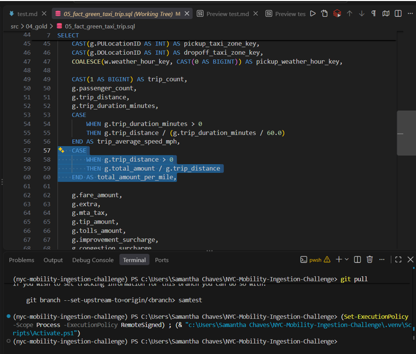
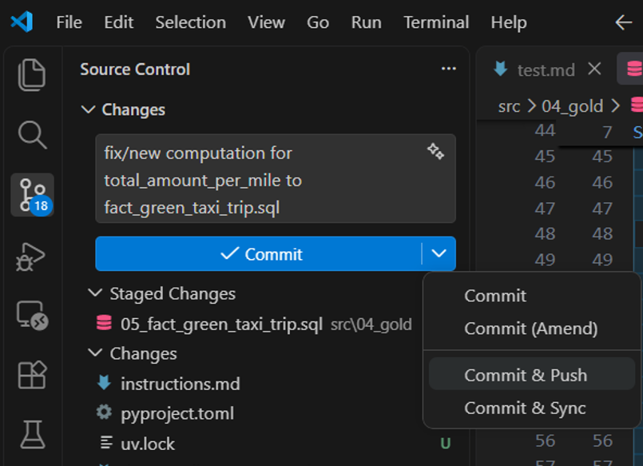
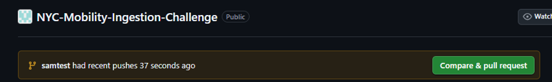
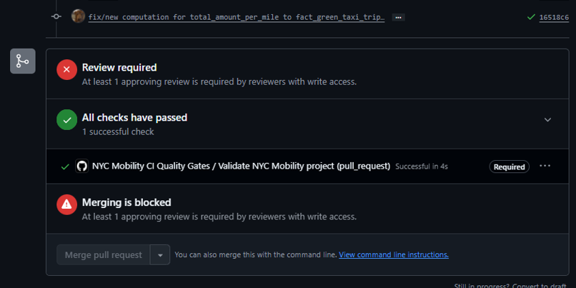
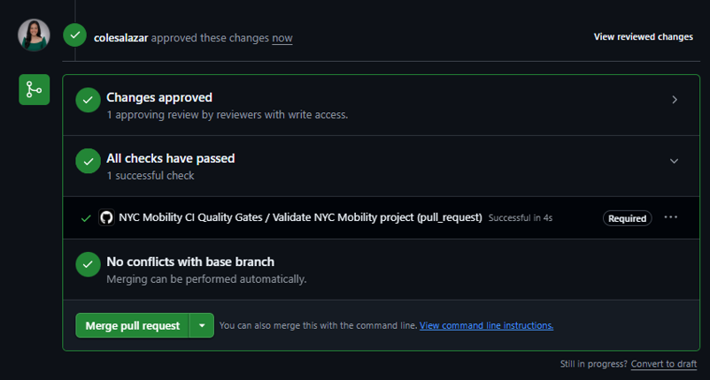
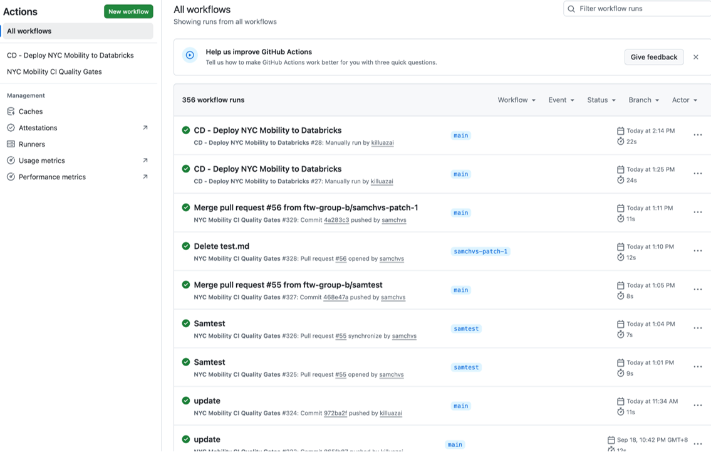

# Group Exercise — Ship NYC Mobility (Group B)

*Think of one simple change we can introduce as a homework, then use that to map out the steps to go through the CI/CD process.*

> **Note:** Group B did not create a new repo for the documentation. Instead, we used our existing NYC Mobility repository and demonstrated the CI/CD process by modifying a notebook, pushing the changes to GitHub, letting CI validate the changes, and then allowing CD to deploy the updated notebook to Databricks.

---

# NYC Mobility - VSCode Integration & CI/CD Workflow Guide

Welcome to the NYC Mobility project! This guide explains how to integrate Visual Studio Code (VSCode) with our existing project repository and details the end-to-end Continuous Integration and Continuous Deployment (CI/CD) workflow.

## Project Setup & VSCode Integration

Rather than creating a new repository, we are utilizing the existing **NYC Mobility** repository. 

To get started:
1. **Clone/Pull the Repository**: Clone the existing repository to your local machine using Git. If you already have it, make sure to pull the latest changes from the main branch.
2. **Open in VSCode**: Open the cloned directory in Visual Studio Code. You can do this by launching VSCode and selecting `File > Open Folder...`, or by navigating to the repository folder in your terminal and running:
   ```bash
   code .
   ```

## Making Local Modifications

Once the project is open in VSCode, you can begin making code modifications. VSCode provides a rich editing experience with built-in terminal and file explorer.

### Example: Modifying a Query
For this exercise, we will modify the `05_fact_green_taxi_trip.sql` file to calculate the `total_amount_per_mile`.

1. Navigate to `src/04_gold/05_fact_green_taxi_trip.sql` in the VSCode file explorer.
2. Update the query logic to include the calculation for `total_amount_per_mile`.



## Version Control (Git)

After making your local changes, you need to stage, commit, and push them to a remote branch.

1. **Create a Branch**: Create a new branch for your work (e.g., `samtest`).
2. **Stage Changes**: Go to the **Source Control** view in VSCode (the branch icon on the left sidebar). Click the `+` icon next to the modified file (`05_fact_green_taxi_trip.sql`) to stage it.
3. **Commit**: Enter a descriptive commit message (e.g., `fix/new computation for total_amount_per_mile to fact_green_taxi_trip.sql`) and click the **Commit** button.
4. **Push**: Click **Publish Branch** or **Sync Changes** to push your commit to the remote repository. Alternatively, you can use the VSCode terminal:
   ```bash
   git commit -m "fix/new computation for total_amount_per_mile to fact_green_taxi_trip.sql"
   git push origin samtest
   ```



## Pull Request & CI Validation

With your changes pushed to the remote branch, the next step is to create a Pull Request (PR) to merge your code into the main branch.

1. **Create PR**: Navigate to the repository on GitHub. You should see a prompt to **Compare & pull request** for your recently pushed branch. Click it, provide a title and description, and create the PR.
   


2. **CI Pipeline Validation**: Once the PR is created, our Continuous Integration (CI) pipeline, known as **NYC Mobility CI Quality Gates**, will automatically trigger to validate the modified code. Developers must wait for all CI checks to pass successfully before proceeding.



## Review and Merge

To maintain code quality, we require peer reviews on all pull requests.

1. **Peer Approval**: At least one approving review from a peer with write access (e.g., `colesalazar`) is required.
2. **Merge**: Once the CI checks have passed and the required approval is obtained, the PR can be successfully merged and closed.



## Continuous Deployment (CD)

Our deployment process is automated using GitHub Actions. 

Upon successfully merging the PR into the main branch, the Continuous Deployment (CD) pipeline (`CD - Deploy NYC Mobility to Databricks`) is automatically triggered. This pipeline safely deploys the updated code and notebooks directly to Databricks.


