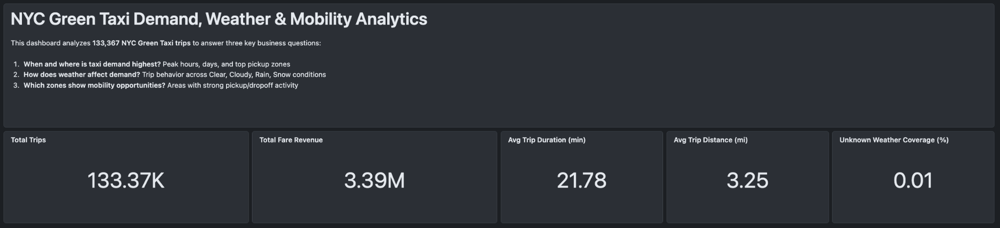
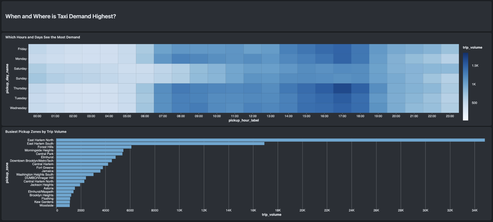
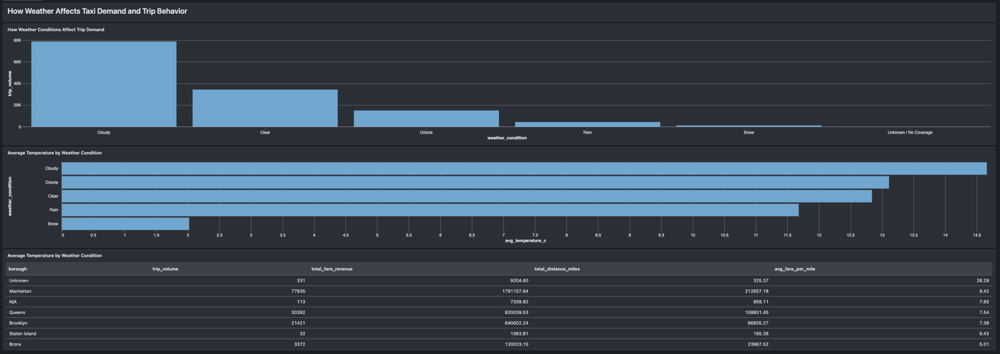
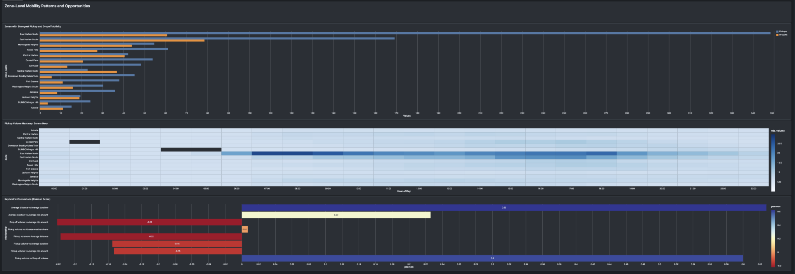

# Business-Ready Analytics Dashboard

## Overview and key performance indicators

## Taxi demand

## Weather and trip behavior

## Zone-level mobility patterns

The dashboard reads three Gold views created under `notebooks/05_analytics/`:

- `analytics_taxi_demand`
- `analytics_weather_behavior`
- `analytics_area_mobility_patterns`

Recommended pages:

1. Demand by date, weekday, hour, and pickup zone
2. Weather-associated demand and trip behavior
3. Pickup/drop-off area patterns and peak pickup hours

All queries filter `dq_out_of_range_datetime = FALSE` for the March-May assignment window. Weather results describe association, not causation.

The separate checks in `tests/analytics/` reconcile dashboard trip volumes and verify each view's declared grain.
