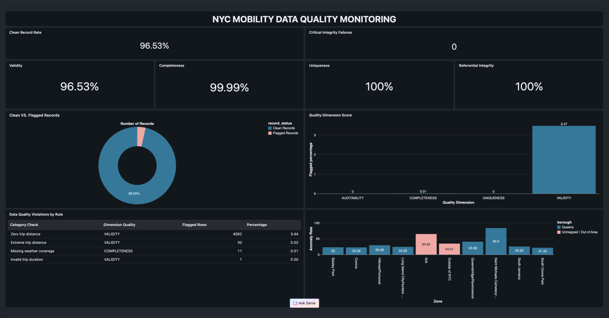

# Data Quality Dashboard

The dashboard reads the `dq_dashboard_*` monitoring views and the consolidated `pipeline_quality_gate_summary`.

Recommended pages:

1. Overall PASS/FAIL and clean-row percentage
2. Quality-attribute scores
3. Problem-area drill-down
4. Source-to-layer reconciliation
5. Foreign-key and join-cardinality checks
6. Zone-level quality hotspots

The dashboard separates actual data-quality conditions from records that are only outside the March-May analysis window.
